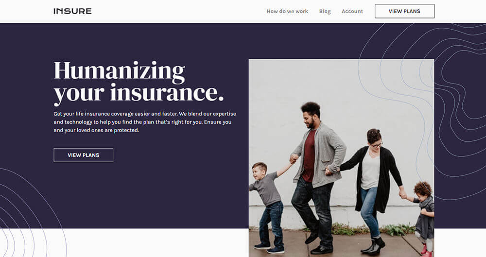
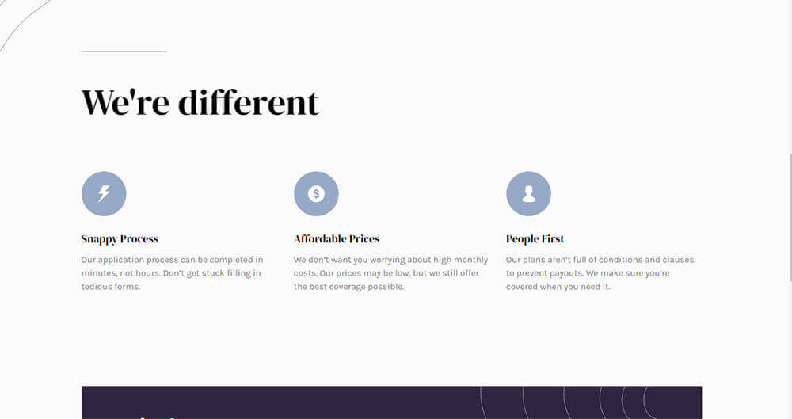
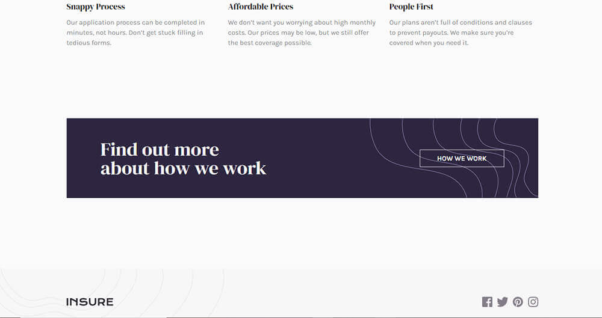
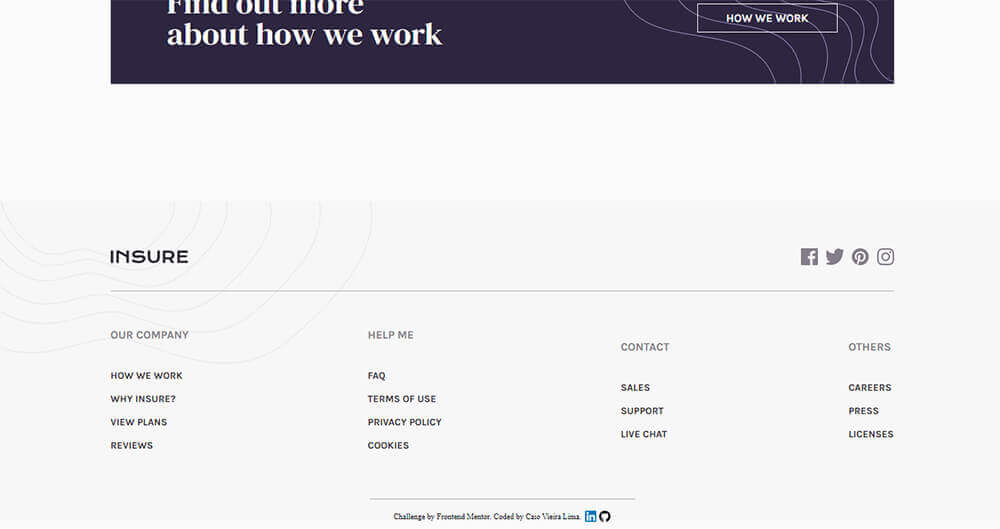
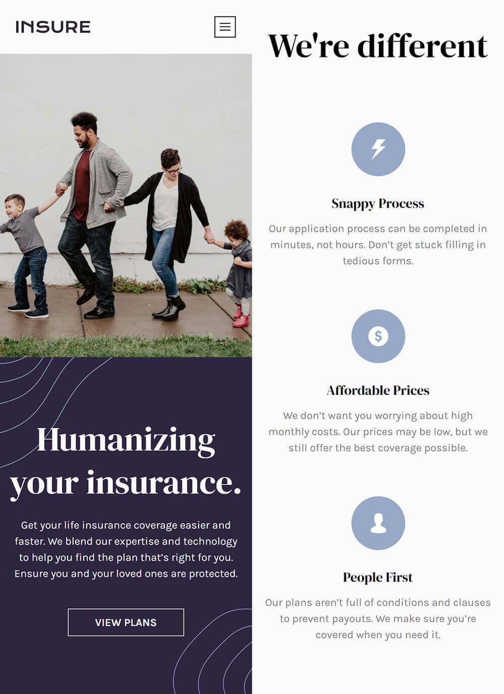
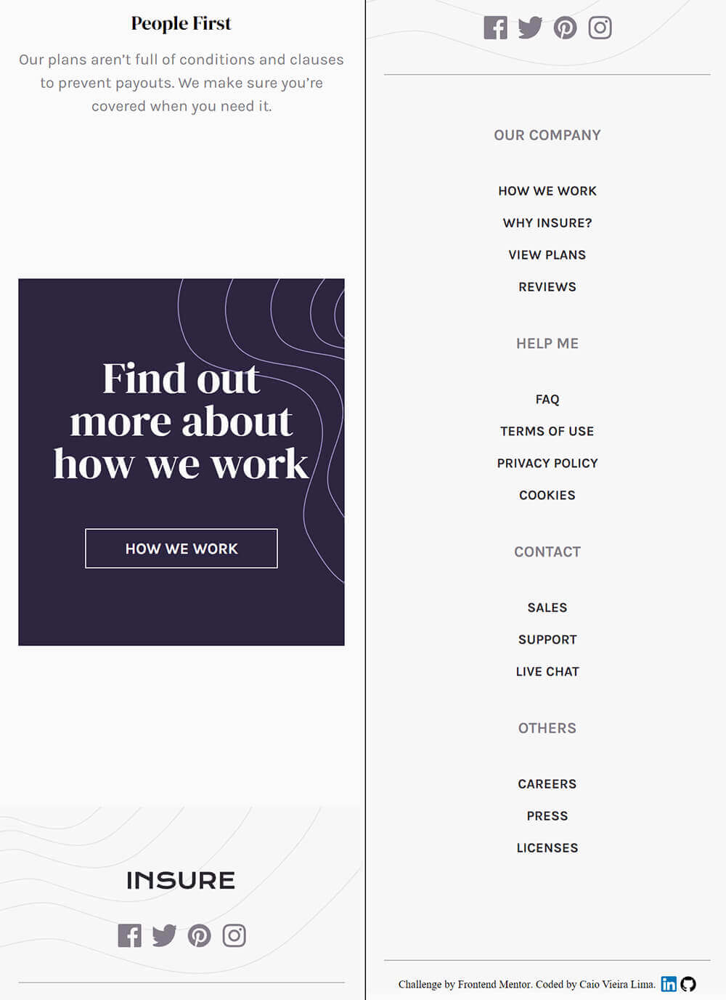
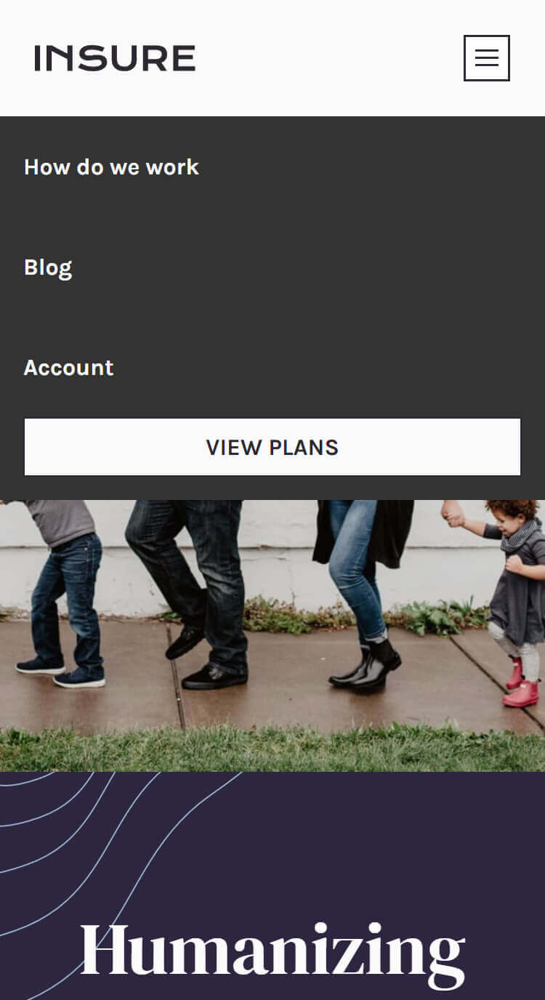

# Product Preview Card Component | Frontend Mentor

Hi, this is my solution for Frontend Mentor's challenge. This is a simple challenge that is about to make a landing page just using: HTML, CSS and JS.

 

## Table of contents

- [Overview](#overview)
  - [The challenge](#the-challenge)
  - [Screenshot](#screenshot)
- [Link](#link)
- [Author](#author)

 

***

 

## Overview

### The challenge

Users should be able to:

- View the optimal layout for the site depending on their device's screen size
- See hover states for all interactive elements on the page

 

### Screenshots

- Desktop

 

- Mobile

 

***

 

## Link

- <a href = "https://miniprojectsnchallenges.netlify.app/insurelandingpage/">My Solution</a>
- <a href= "https://www.frontendmentor.io/challenges/insure-landing-page-uTU68JV8">Frontend Mentor challenge page</a>

 
 

## Author

- [Caio Vieira de Castro Lima](https://www.linkedin.com/in/caiovieiralima/)