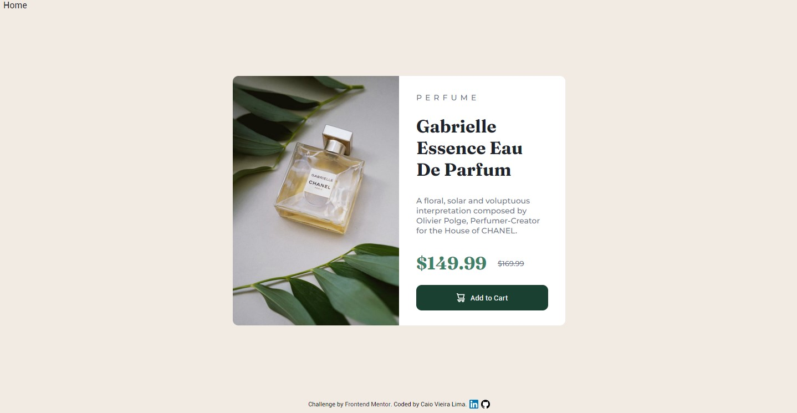

# Product Preview Card Component | Frontend Mentor

Hi, this is my solution for Frontend Mentor's challenge. This is a simple challenge that is about to make a 
product preview card component just using: HTML and CSS.

 

## Table of contents

- [Overview](#overview)
  - [The challenge](#the-challenge)
  - [Screenshot](#screenshot)
- [Link](#link)
- [Author](#author)

 

***

 

## Overview

### The challenge

Users should be able to:

- View the optimal layout depending on their device's screen size
- See hover and focus states for interactive elements

 

### Screenshots

 

***

 

## Link

- <a href = "https://miniprojectsnchallenges.netlify.app/productpreviewcardcomp/">My Solution</a>
- <a href= "https://www.frontendmentor.io/challenges/product-preview-card-component-GO7UmttRfa">Frontend Mentor challenge page</a>

 
 

## Author

- [Caio Vieira de Castro Lima](https://www.linkedin.com/in/caiovieiralima/)